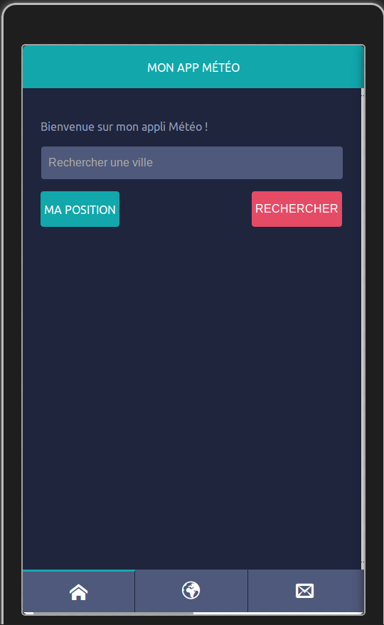
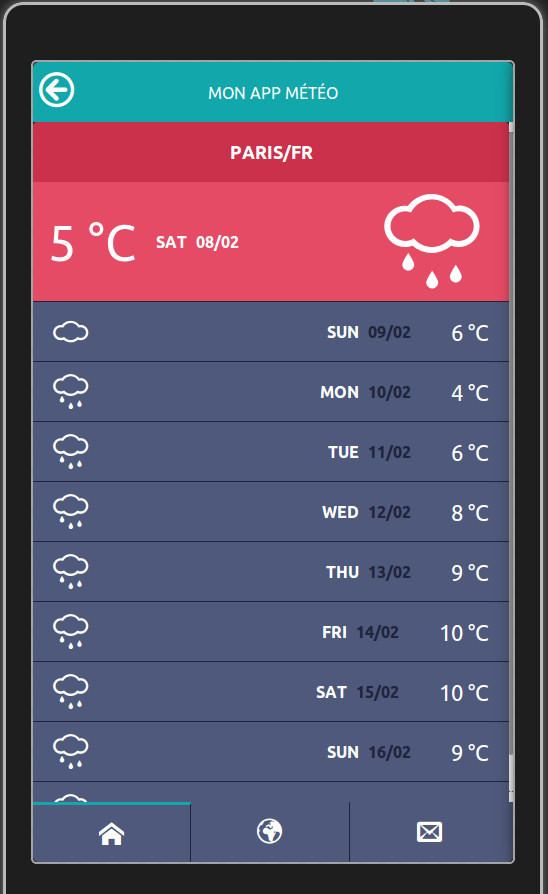

Weather App
=============

This application was built using Apache Cordova.

Why this app ?
---------------
The aim of the app is to fetch and show the meteo of the week very quickly on your phone or tablet. You can choose to see the weather in your current position thanks to the geolocation or fetch it from the position you decide.


Technology
----------
* HTML5
* CSS3
* JavaScript (Angular JS)


How to use:
------------
* Create a new Cordova project
* Download this repo and extract it in ```www``` of your project
* Connect your device to your computer
* Run ```cordova run android```
* Enjoy !


Screenshot
----------




Credit
--------
* [Grafikart](http://www.grafikart.fr/tutoriels/cordova/cordova-angular-454) for his amazing tutorial
* [Raul Taciu](http://dribbble.com/shots/1135984-Flat-Design-UI-Components?list=searches) for the design of the app.